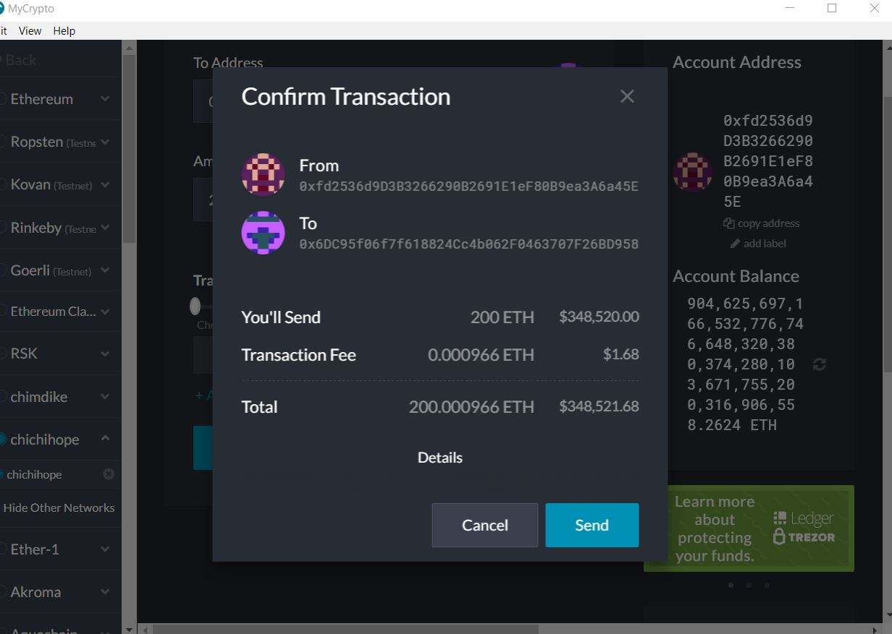

# RUNNING THE 'chichihope' NETWORK

The 'project' network is a private blockchain network running on a Proof of Authority (PoA) algorithm.  

# Network Configuration

The name of the network is: **chichihope**. This is a private blockchain network running on a Proof of Authority (PoA) algorithm. The nodes are pre-funded.
    

The ChainID to be used: **666**.
    

The block time of the network is **15secs**.

epoch: 30000 

Account Password: **password**

Ports: 30303

# Initiating the Network & BlockMining
1.  The nodes in the network can be initiated with genesis file as shown below.

    * Using `geth`, initialize each node with the `chichihope.json`.
        * ./geth --datadir node1 init chichihope.json
        * ./geth --datadir node2 init chichihope.json

2. Now the nodes can be used to begin mining blocks.

    * Run the nodes in separate terminal windows with the commands:
        *  ./geth --datadir node1 --unlock "0xfd2536d9D3B3266290B2691E1eF80B9ea3A6a45E" --mine --rpc --allow-insecure-unlock
        *  ./geth --datadir node2 --unlock "0x6DC95f06f7f618824Cc4b062F0463707F26BD958" --mine --port 30304 --bootnodes "enode://11e0a539cb656fdc375523eaf58a083064307fc1c5fd5638b28eee6aa1a2fae1818233689ec16f50db64750562048bf5497b3bb432df32a811ff720e62bd4fbc@127.0.0.1:30303" --ipcdisable --allow-insecure-unlock
    * **NOTE:**  Password: **password**
    You'll have to enter the password even though you cant see what you are typing.

 The PoA blockchain should now be running at this point!

# Connecting MyCrypto to the Network

1. With the nodes running, the blockchain can be added to MyCrypto.

    * Open the MyCrypto app, then click `Change Network` at the bottom left:

    

    * Click `Add Custom Node` at the bottom left, then add the custom network information that you set in the genesis.

    

    * Scroll down to choose `Custom` in the "Network" column to reveal more options like `Chain ID`:

    

    * In Network Name field, type: `chichihope`
    
    * Type `ETH` in the Currency box.
    
    * In the Chain ID box, type **666**.

    * In the URL box type: `http://127.0.0.1:8545`.  This points to the default RPC port on your local machine.

    * Finally, click `Save & Use Custom Node`. MyCrypto is now connected to the custom network.

2. After connecting to the custom network in MyCrypto, it can be tested by sending money between accounts.

    * Select the `View & Send` option from the left menu pane, then click `Keystore file`.

    

    * On the next screen, click `Select Wallet File`, then navigate to the keystore directory inside your node's directory, select the file in there, and provide your password when prompted and then click `Unlock`.

    * This opens the account wallet inside MyCrypto. 

    * In the `To Address` box, type the account address you want to test with, then fill in an arbitrary amount of ETH.

    * Confirm the transaction by clicking `Send Transaction`, and the `Send` button in the pop-up window.  

    

    * Click the `Check TX Status` when the green message pops up, confirm the logout:

    

    * The transaction should go from `Pending` to `Successful` in around the same blocktime set in the genesis.

    * You can click the `Check TX Status` button to update the status.

    

